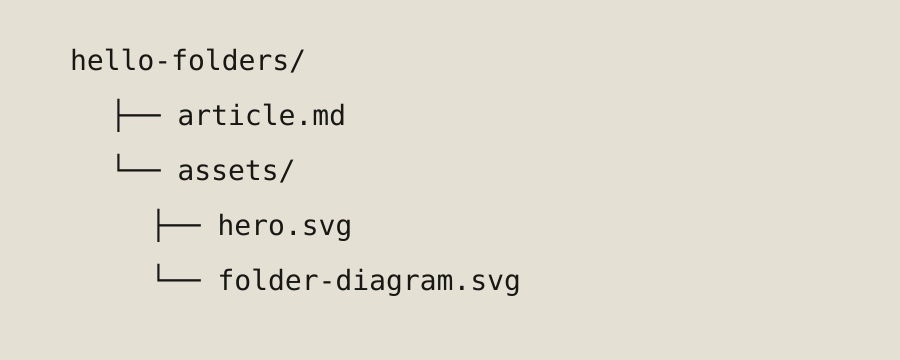

## Welcome to the machine

This entire article lives in one directory. The words are in `article.md`; everything else is baggage in `assets/`.



### It already speaks GitHub-ish Markdown

| Ingredient | Job |
| --- | --- |
| YAML | Front-page metadata |
| Markdown | The actual writing |
| Asset folder | Images without archaeological expeditions |

```python
for article in discover_articles():
    if article.release_at <= now:
        publish(article)
```

> No database was harmed in the making of this blog.
